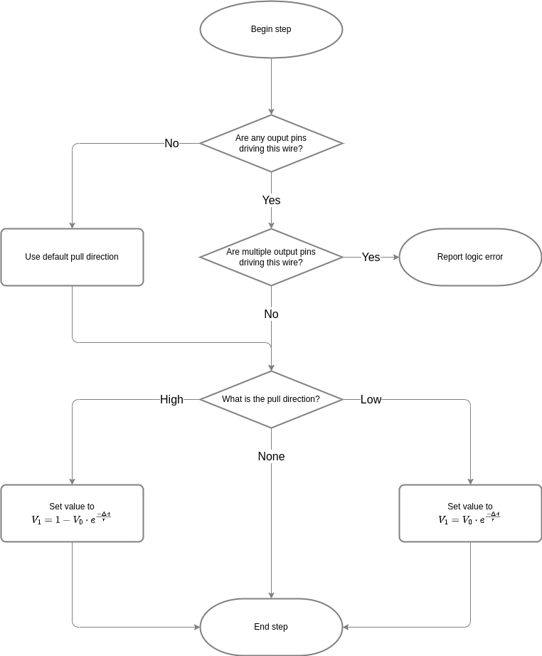
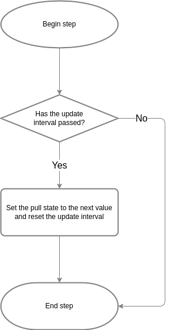
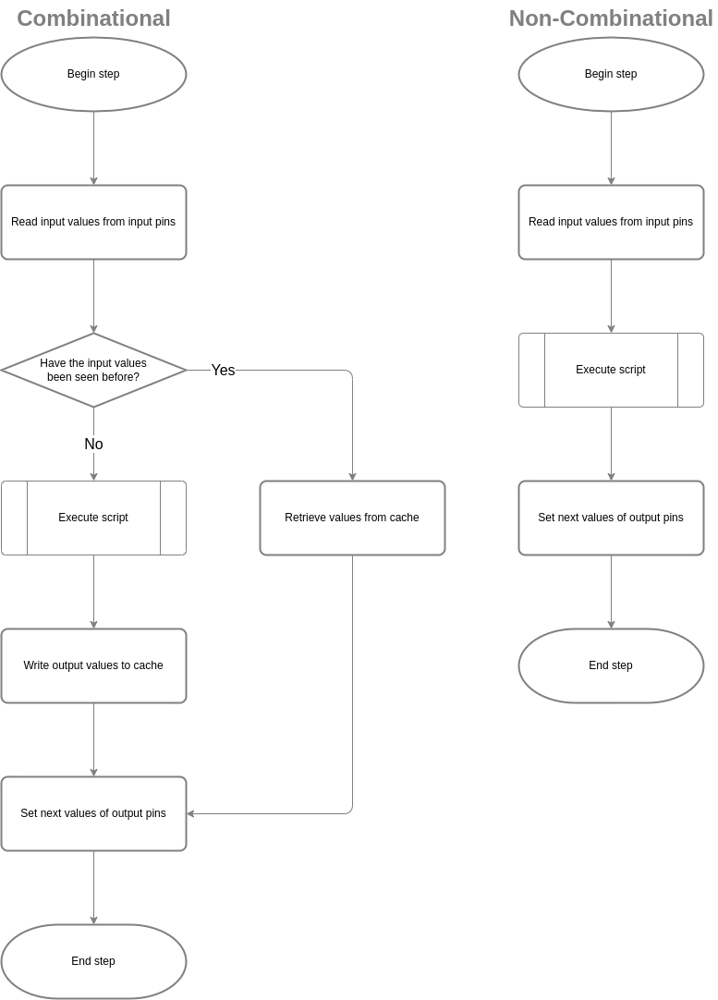

# RISC-V from Scratch Simulator

This project is ancillary to the primary RISC-V from Scratch (CPU) project and is concerned with the design and
development of a basic simulator to explore the processor logic implementation.

## Building and Installing

*TBD*

## Architecture

The simulator creates a representation of the digital system as a collection of wires, input pins, logic, and
output pins.  It then iterates the system state by repeatedly stepping the simulation by a fixed but configurable
interval.

The individual components mutate their state according to their innate properties:

### Wire

 * Has a value in the range of 0.0 to 1.0 representing the logic state of the wire.
 * Has a default pull direction, which sets the value that it wants to move towards in the absence of any outside
   driver.
 * Has an explicit pull direction, which sets the value that it wants to move towards based on external drivers.
 * Has a time constant (τ) which determines the rate at which its value moves towards the active pull direction.
 * Has zero or more connected input pins.
 * Has zero or more connected output pins.

### Output Pin

 * Has an output drive value of high, low, or none.
 * Has a delay factor which determines how much simulated time passes between when the associated component sets the
   next value of the pin and that value appears as the output drive value.
    - Changing the next value resets the propagation time counter.

### Logic Element

 * Has a block of arbitrary code which executes whenever an input value from an associated input pin changes.
    - The code block receives input values and sets the next output values.
 * For purely combinational logic, has a cache which eliminates the need to re-run the code block once a particular
 * input combination has been seen.
    - The cache is shared for all instances of a type to further minimize re-execution.
 * Has zero or more connected input pins.
 * Has zero or more connected output pins.

### Input Pin
 *  Has an input value of high, low, or indeterminate.
 *  Has a high bound which determines the value of the connected wire at or above which the pin is considered high.
 *  Has a low bound which determines the value of the connected wire at or below which the pin is considered low.

