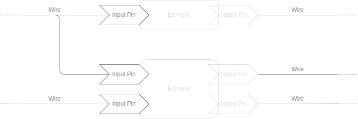
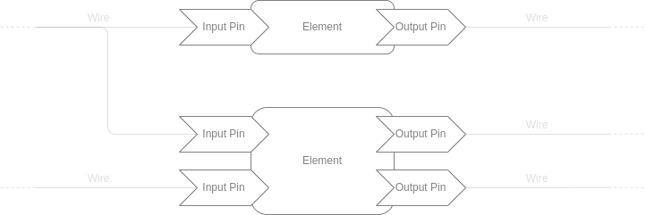
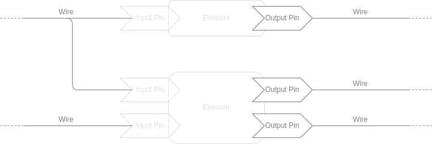
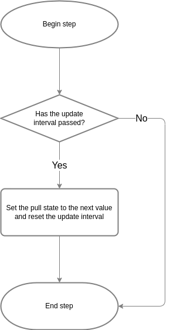
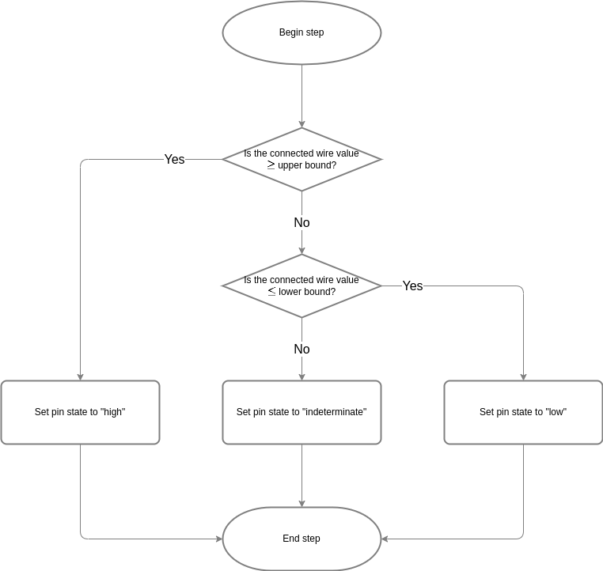

# Architecture

The simulator creates a representation of the digital system as a collection of wires, input pins, logic elements, and
output pins.  It then iterates the system state by repeatedly stepping the simulation by a fixed but configurable
interval.

## Sequencing

The input and output pins have their ownership passed back and forth between the associated wires and elements at
different stages of the simulation.  Each step is broken into three phases.

### Phase 1: Input Pin State Updates

In the first phase, each wire has its value measured, and each associated input pin updates its internal state based on
that measurement.  The collection of the wire and input pins is "checked-out" of the simulation and passed off to a
thread pool for this calculation, allowing many wire/pin combinations to update in parallel.  All of the items are
passed back the end of the phase and given back to the parent simulation.

### Phase 2: Element Calculations

For the second phase, if any of the input pins associated with an element have changed state, then element recalculates
its output values and sets the next values of its associated output pins accordingly.  As with the wires in the first
phase, the collection of input pins, element, and output pins is "checked-out" and updated in parallel on the thread
pool, with the items and result passed back to the parent simulation.

### Phase 3: Wire Updates

For the final phase of a simulation step, each wire evaluates its associated output pins to see if there are any drive
changes (the pins propagate their next value first, if necessary).  If the drive has changed, then wire updates its
active pull direction.  Subsequently, the wire calculates its new level based.  This follows the same "check-out," run
on thread, and "check-in" pattern as the previous phases.

## Components

The individual components mutate their state according to their innate properties:

### Wire

 * Has a value in the range of 0.0 to 1.0 representing the logic state of the wire.
 * Has a default pull direction, which sets the value that it wants to move towards in the absence of any outside
   driver.
 * Has an explicit pull direction, which sets the value that it wants to move towards based on external drivers.
 * Has a time constant (τ) which determines the rate at which its value moves towards the active pull direction.
 * Has zero or more connected input pins.
 * Has zero or more connected output pins.

### Output Pin

 * Has an output drive value of high, low, or none.
 * Has a delay factor which determines how much simulated time passes between when the associated component sets the
   next value of the pin and that value appears as the output drive value.
    - Changing the next value resets the propagation time counter.

### Logic Element

 * Has a block of arbitrary code which executes whenever an input value from an associated input pin changes.
    - The code block receives input values and sets the next output values.
 * For purely combinational logic, has a cache which eliminates the need to re-run the code block once a particular
 * input combination has been seen.
    - The cache is shared for all instances of a type to further minimize re-execution.
 * Has zero or more connected input pins.
 * Has zero or more connected output pins.

### Input Pin
 *  Has an input value of high, low, or indeterminate.
 *  Has a high bound which determines the value of the connected wire at or above which the pin is considered high.
 *  Has a low bound which determines the value of the connected wire at or below which the pin is considered low.

